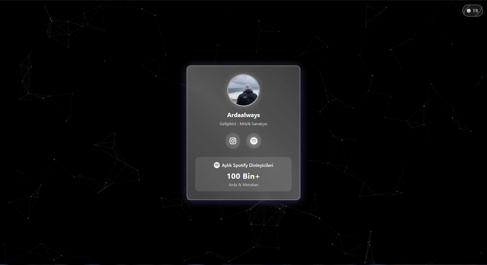
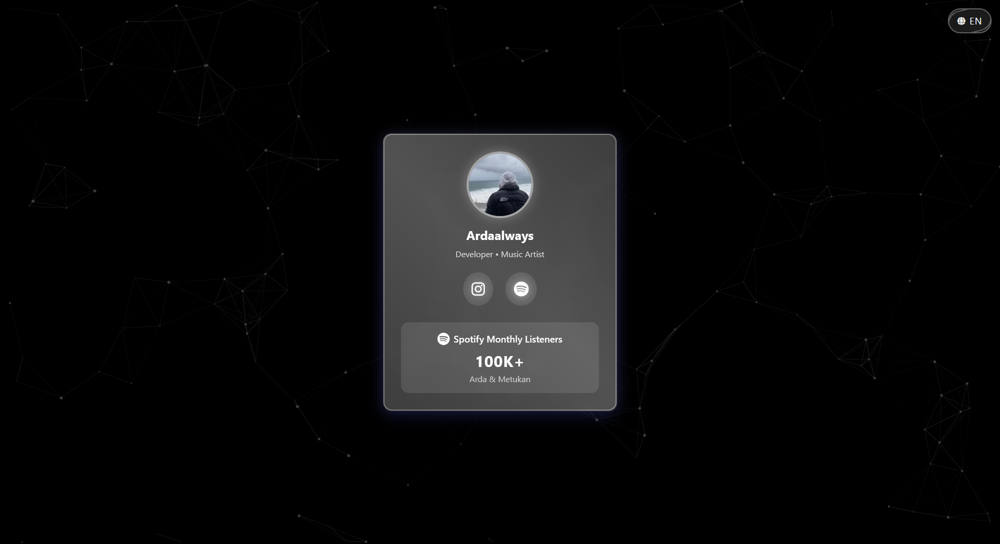

# Personal Portfolio & Music Artist Showcase

A modern, responsive personal portfolio website featuring a glassmorphism design, particle.js background, and language switching capabilities.

## ✨ Features

- 🌐 Multi-language support (TR/EN)
- 🎨 Glassmorphism UI design
- 🎵 Spotify integration
- 🌟 Particle.js background effects
- 📱 Fully responsive design
- 🚀 Smooth animations and transitions

## 🛠️ Technologies Used

- HTML5
- CSS3
- JavaScript
- TailwindCSS
- Particle.js
- ScrollReveal.js
- Font Awesome

## 📄 License

This project is licensed under the MIT License. See the [LICENSE](LICENSE) file for details.
